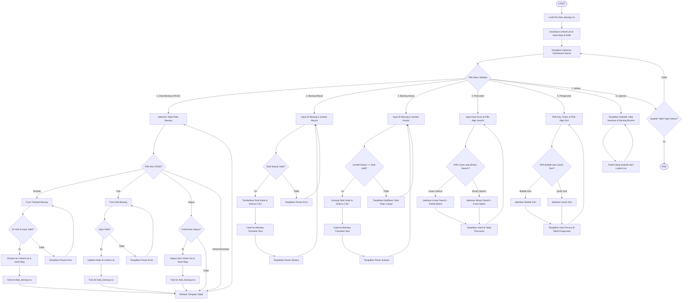

# Aplikasi Sistem Manajemen Gudang Berbasis Python dengan Database File CSV

Proyek ini dibuat sebagai **Tugas Akhir / Project UAS** Mata Kuliah **Struktur Data**. Aplikasi ini merupakan sistem manajemen inventaris gudang modern (dashboard desktop) yang menggunakan database berbasis file CSV, serta memanfaatkan struktur data **Linked List** dan **Hash Map (Dictionary)** untuk efisiensi penyimpanan memori dan manipulasi data.

---

## 📋 Daftar Isi
1. [Struktur File Proyek](#-struktur-file-proyek)
2. [Cara Menjalankan Aplikasi](#-cara-menjalankan-aplikasi)
3. [Penjelasan Struktur Data Wajib](#-penjelasan-struktur-data-wajib)
4. [Penjelasan Algoritma Searching](#-penjelasan-algoritma-searching)
5. [Penjelasan Algoritma Sorting](#-penjelasan-algoritma-sorting)
6. [Flowchart Alur Aplikasi](#-flowchart-alur-aplikasi)

---

## 📂 Struktur File Proyek

Proyek ini diorganisasikan dengan struktur file sebagai berikut:

```text
Sistem-Gudang/
├── data_barang.csv           # File database CSV utama untuk penyimpanan data inventaris
├── linkedlist.py             # Implementasi struktur data Linked List (Node & LinkedList)
├── database.py               # Pengontrol database CSV dan sinkronisasi dengan Linked List & Hash Map
├── searching.py              # Implementasi algoritma pencarian (Linear Search & Binary Search)
├── sorting.py                # Implementasi algoritma pengurutan (Quick Sort & Bubble Sort)
├── main.py                   # Program utama GUI Dashboard berbasis CustomTkinter
├── verify_data_structures.py # Script pengujian otomatis untuk memvalidasi backend sistem
└── README.md                 # Dokumentasi penjelasan lengkap aplikasi (file ini)
```

### Penjelasan Setiap File:
1. **`data_barang.csv`**: File teks dengan format CSV yang bertindak sebagai database lokal. Kolom yang digunakan: `ID_Barang,Nama_Barang,Kategori,Stok,Harga,Supplier`.
2. **`linkedlist.py`**: Mengandung kelas `BarangNode` dan `BarangLinkedList`. Berfungsi sebagai penyimpanan data dinamis utama di dalam memori RAM komputer selama aplikasi berjalan.
3. **`database.py`**: Berisi kelas `DatabaseController` yang memuat data dari file CSV ke Linked List dan Dictionary saat program dijalankan, serta menulis kembali data ke file CSV ketika terjadi penambahan, pengubahan, atau penghapusan data.
4. **`searching.py`**: Menyediakan fungsi pencarian data barang berdasarkan kriteria (Nama Barang atau ID Barang) dengan pilihan algoritma *Linear Search* atau *Binary Search*.
5. **`sorting.py`**: Menyediakan fungsi pengurutan data barang (berdasarkan Nama Barang, Stok, atau Harga) secara *Ascending* atau *Descending* menggunakan *Bubble Sort* atau *Quick Sort*.
6. **`main.py`**: Aplikasi utama dengan GUI (Graphical User Interface) modern menggunakan library `customtkinter` yang menyediakan sidebar menu, dashboard interaktif, form input barang masuk/keluar, tabel interaktif (Treeview), form CRUD, dan visualisasi statistik laporan gudang.
7. **`verify_data_structures.py`**: Program kecil untuk memverifikasi logika backend (Linked List, HashMap, sorting, searching, dan file I/O) berjalan dengan benar bebas dari bug sebelum program GUI dipanggil.

---

## 🚀 Cara Menjalankan Aplikasi

### Persyaratan Sistem:
- Python versi 3.x terinstal di komputer.
- Library `customtkinter` terinstal.

### Langkah-langkah Menjalankan:

1. **Instalasi Dependensi**  
   Buka Terminal atau Command Prompt (cmd) di folder proyek ini, kemudian jalankan perintah instalasi library GUI modern CustomTkinter:
   ```bash
   pip install customtkinter
   ```

2. **Menjalankan Tes Backend (Opsional)**  
   Pastikan struktur data dan algoritma bekerja dengan baik dengan menjalankan skrip tes:
   ```bash
   python verify_data_structures.py
   ```
   Jika muncul pesan `=== Semua Pengujian Berhasil Dilalui! ===`, maka seluruh logika backend 100% aman dan bekerja dengan benar.

3. **Menjalankan Aplikasi Utama**  
   Jalankan file `main.py` untuk membuka dashboard GUI:
   ```bash
   python main.py
   ```

---

## 🧠 Penjelasan Struktur Data Wajib

Untuk memenuhi standar akademik UAS Struktur Data, proyek ini menggunakan dua struktur data secara bersamaan untuk mengelola data barang di memori program (RAM):

### 1. Linked List (`linkedlist.py`)
Linked List adalah struktur data linier non-kontigu di mana elemen-elemen disimpan dalam objek bernama **Node**. Setiap Node terdiri dari dua bagian utama:
* **Data**: Informasi dari objek barang itu sendiri (`ID_Barang`, `Nama_Barang`, `Kategori`, `Stok`, `Harga`, `Supplier`).
* **Next**: Pointer (referensi penunjuk) ke alamat Node berikutnya di memori.

```text
  [Head]
    |
    v
+---------------+      +---------------+      +---------------+
| ID: 001       |      | ID: 002       |      | ID: 003       |
| Nama: Laptop  |      | Nama: Mouse   |      | Nama: Kursi   |
| Next -------->|----->| Next -------->|----->| Next: None    |
+---------------+      +---------------+      +---------------+
```

* **Mengapa Menggunakan Linked List?**  
  Linked List sangat fleksibel dalam penambahan (*insertion*) dan penghapusan (*deletion*) data baru karena tidak memerlukan alokasi memori kontigu yang kaku (seperti array/list statis). Kita tinggal merubah penunjuk `next` dari node sebelum atau setelahnya tanpa harus menggeser elemen memori lain.
* **Kompleksitas Waktu Linked List:**
  - Penambahan di akhir (Append): $O(N)$ atau $O(1)$ jika menyimpan pointer Tail. Pada program ini dilakukan traversal hingga ujung list dengan kompleksitas $O(N)$ untuk implementasi murni struktur data.
  - Traversing/Menampilkan: $O(N)$ karena harus menelusuri dari `head` satu per satu.

### 2. Hash Map / Dictionary (Bawaan Python)
Dictionary di Python menggunakan tabel hash (*Hash Map*) di balik layar untuk memetakan sebuah **Key** unik ke sebuah **Value**. Di proyek ini, key-nya adalah `ID_Barang` dan value-nya adalah referensi langsung ke objek `BarangNode` yang berada di dalam Linked List.

```text
Hash Map / Dictionary:
Key (ID_Barang)  --->  Value (Referensi Objek BarangNode di Linked List)
   "001"         --->  Alamat Node Barang ID 001
   "002"         --->  Alamat Node Barang ID 002
```

* **Mengapa Menggunakan Hash Map?**  
  Linked list memiliki kelemahan dalam pencarian elemen, yaitu membutuhkan waktu $O(N)$ karena harus menelusuri node dari awal. Dengan membuat Hash Map yang mereferensikan node-node di Linked List berdasarkan `ID_Barang`, kita dapat melakukan pencarian data barang, pengecekan keunikan ID, dan perubahan data secara instan dengan waktu konstan.
* **Kompleksitas Waktu Hash Map:**
  - Pencarian berdasarkan ID: $O(1)$ (Sangat cepat dan tidak dipengaruhi ukuran data).
  - Penghapusan/Update berdasarkan ID: $O(1)$ untuk menemukan node.

---

## 🔍 Penjelasan Algoritma Searching

Pencarian (*Searching*) adalah proses menemukan item dengan karakteristik tertentu di dalam sekumpulan data. Aplikasi ini menyediakan dua algoritma:

### 1. Linear Search (Pencarian Berurutan)
Linear Search bekerja dengan membandingkan kata kunci pencarian secara sekuensial (berurutan) mulai dari elemen pertama hingga elemen terakhir di dalam daftar.
* **Kelebihan**: Sangat fleksibel. Data tidak perlu diurutkan terlebih dahulu. Dapat digunakan untuk melakukan pencarian sebagian (*partial match / substring search*), misalnya mengetik kata "lap" akan memunculkan "Laptop".
* **Kekurangan**: Lambat untuk jumlah data besar.
* **Kompleksitas Waktu**: Terburuk (*Worst-case*) $O(N)$, Terbaik (*Best-case*) $O(1)$.

### 2. Binary Search (Pencarian Biner)
Binary Search bekerja dengan cara membagi dua ruang pencarian secara berulang-ulang pada data yang **sudah terurut**. Algoritma membandingkan kata kunci dengan nilai tengah:
1. Jika kata kunci sama dengan nilai tengah, pencarian selesai.
2. Jika kata kunci lebih kecil dari nilai tengah, pencarian dilanjutkan pada setengah bagian kiri.
3. Jika kata kunci lebih besar dari nilai tengah, pencarian dilanjutkan pada setengah bagian kanan.
* **Kelebihan**: Sangat cepat untuk data dalam skala besar.
* **Kekurangan**: Wajib dilakukan pengurutan (*sorting*) data terlebih dahulu berdasarkan kriteria pencarian sebelum algoritma ini dijalankan. Hanya cocok untuk pencarian persis (*exact match*).
* **Kompleksitas Waktu**: Terburuk (*Worst-case*) $O(\log N)$, Terbaik (*Best-case*) $O(1)$.

---

## 🔀 Penjelasan Algoritma Sorting

Pengurutan (*Sorting*) adalah proses menyusun elemen-elemen data dalam urutan tertentu (urut naik/*ascending* atau urut turun/*descending*). Aplikasi ini menerapkan dua algoritma:

### 1. Bubble Sort
Bubble Sort adalah algoritma pengurutan sederhana yang bekerja dengan cara membandingkan dua elemen yang bersebelahan berulang kali, lalu menukarnya jika urutannya salah (misal elemen kiri lebih besar dari elemen kanan untuk ascending). Proses ini diulang sampai tidak ada lagi penukaran yang diperlukan (data telah terurut).
* **Kelebihan**: Sederhana untuk diimplementasikan secara akademis.
* **Kekurangan**: Sangat tidak efisien untuk data jumlah sedang hingga banyak karena memakan waktu kuadratik.
* **Kompleksitas Waktu**: Rata-rata & Terburuk $O(N^2)$.

### 2. Quick Sort
Quick Sort adalah algoritma pengurutan modern yang efisien yang menggunakan prinsip **Divide and Conquer** (Bagi dan Taklukkan):
1. **Pivot Selection**: Memilih satu elemen dari array sebagai elemen pembatas (*pivot*).
2. **Partitioning**: Membagi elemen-elemen lain menjadi dua kelompok: kelompok yang nilainya lebih kecil dari pivot dan kelompok yang nilainya lebih besar dari pivot.
3. **Recursion**: Melakukan pengurutan secara rekursif terhadap kedua kelompok tersebut.
* **Kelebihan**: Sangat cepat dan efisien pada kasus rata-rata.
* **Kekurangan**: Rekursi memakan ruang memori stack, dan pada kasus terburuk (misal pivot selalu elemen terkecil/terbesar pada data yang sudah terurut) kecepatannya menurun.
* **Kompleksitas Waktu**: Rata-rata $O(N \log N)$, Terburuk $O(N^2)$.

---

## 📊 Flowchart Alur Aplikasi

Berikut adalah diagram alir (*flowchart*) aplikasi Sistem Manajemen Gudang:

### Diagram Mermaid (Render Otomatis di Github)


### representasi Grafis Teks Alur Kerja Utama
```text
  [ START ]
      │
      ▼
┌──────────────┐
│  LOAD CSV    │---> Membaca file data_barang.csv
└──────────────┘
      │
      ▼
┌──────────────┐
│  DASHBOARD   │<=== Tampilan awal info card (Total stok, varian, dan aktivitas sesi)
└──────────────┘
      │
      ├───[ Pilih Menu: Data Barang (CRUD) ]
      │     └── Tambah / Edit / Hapus Barang ---> Sync Linked List + HashMap ---> Simpan CSV
      │
      ├───[ Pilih Menu: Barang Masuk ]
      │     └── Input ID Barang & Jumlah ---> Tambah Stok Node ---> Simpan CSV
      │
      ├───[ Pilih Menu: Barang Keluar ]
      │     └── Input ID Barang & Jumlah ---> Kurangi Stok (Cek Kecukupan) ---> Simpan CSV
      │
      ├───[ Pilih Menu: Searching ]
      │     └── Pilih ID/Nama + Linear/Binary Search ---> Cari Data ---> Tampilkan Hasil
      │
      ├───[ Pilih Menu: Sorting ]
      │     └── Pilih Nama/Stok/Harga + Bubble/Quick Sort ---> Urutkan Data ---> Tampilkan Hasil
      │
      ├───[ Pilih Menu: Laporan ]
      │     └── Hitung Total Jenis, Total Stok, Total Aset, Stok Terbanyak & Tersedikit
      │
      └───[ Pilih Menu: Keluar ]
            └── Konfirmasi Keluar ---> Close Window ---> [ END ]
```

---
*Dibuat dengan penuh dedikasi untuk mendukung Tugas Akhir Struktur Data Tahun Akademik 2025/2026.*
